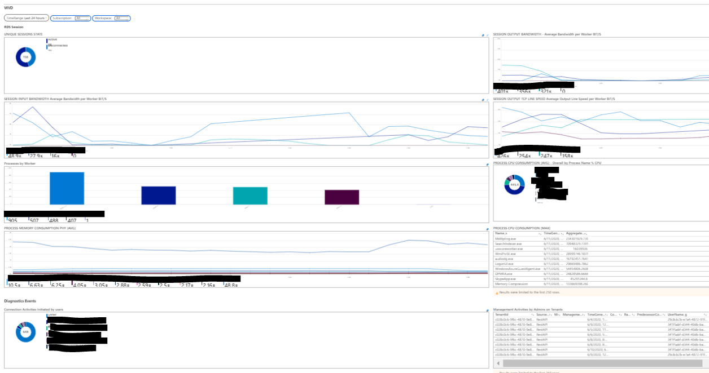
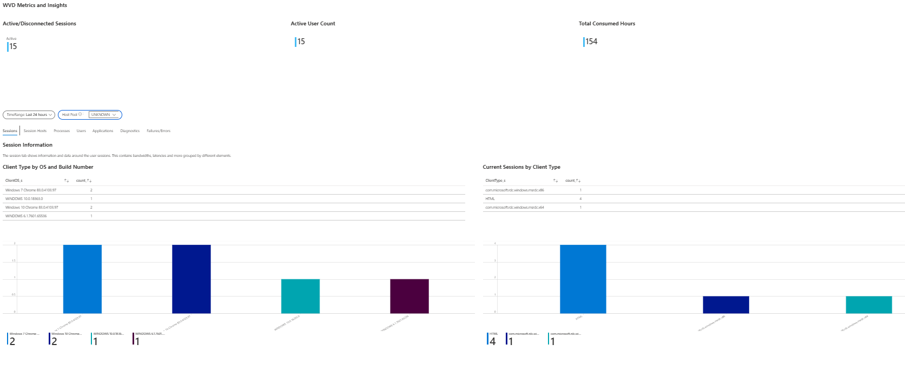

# Windows Virtual Desktop  Workbooks

V.1.0 WVD-By-AC

V.1.0 WVD-By-ML

## Author

Antonio Canitano    ancanita@microsoft.com

Matthew Larkin      matthew.larkin@microsoft.com

## Purpose

These workbooks are intended to ease the report on Windows Virtual Desktop

## Prerequisites
In order to work the workbook needs the prerequisites below:

Enable Disagnostic Logs on Tenant - https://docs.microsoft.com/en-us/azure/virtual-desktop/diagnostics-log-analytics 

Install Segago Agent - http://loganalytics.sepago.com/downloads/ITPC-LogAnalyticsAgent.zip

## Packages

WVD-By-ML.json

WVD-By-AC.json

## Workbook Contents WVD-By-AC

### RDS Session

UNIQUE SESSIONS STATE

SESSION OUTPUT BANDWIDTH - Average Bandwidth per Worker BIT/S

SESSION INPUT BANDWIDTH Average Bandwidth per Worker BIT/S

SESSION OUTPUT TCP LINE SPEED Average Output Line Speed per Worker BIT/S

### PROCESSES

Processes by Worker

PROCESS CPU CONSUMPTION (AVG) - Overall by Process Name % CPU

PROCESS MEMORY CONSUMPTION PHY (AVG)

PROCESS CPU CONSUMPTION (MAX)

### Diagnostics Events

Connection Activities Initiated by users

Management Activities by Admins on Tenants

Azure AD number of WVD sign ins per user

Usage by Users

Usage over time

Access attempts WVD by : unauthorized user, bad password, incorrect MFA, user account does not exist

Connection Activities initiated by users with supported RD Clients

## Workbook Contents WVD-By-ML

### WVD Metrics and Insights

Active/Disconnected Sessions

Active User Count

Total Consumed Hours

### Session Information

Sessions

Session Hosts

Processes

Users

Applications

Diagnostics

Failures/Errors

### Client Type by OS and Build Number

### Current Sessions by Client Type
